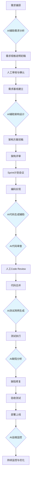
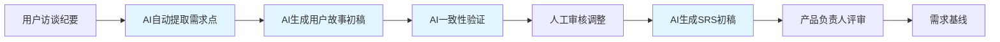
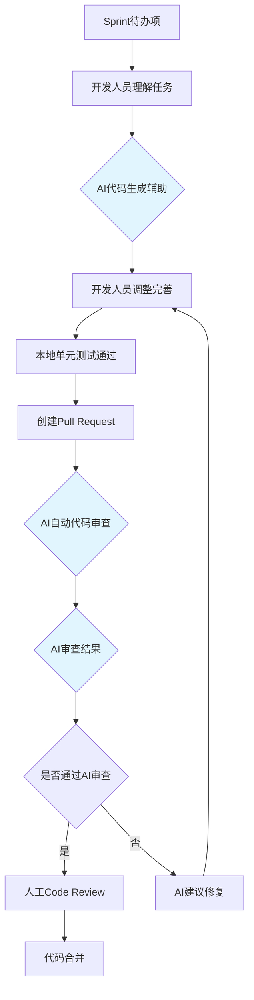
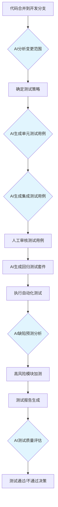

# 软件过程改进方案设计文档

## 一、引言

本文档基于《AI技术应用场景匹配报告》中识别的5个高优先级AI应用场景，设计AI技术与传统软件过程的融合方案。改进方案覆盖新增AI相关角色、调整活动流程融入AI工具执行节点、定义AI输出物质量标准与验证机制，以及工具链选型与风险评估。

改进后的软件过程旨在实现三个核心目标：
1. **效率提升**：通过AI自动化降低重复性劳动时间不少于50%
2. **质量增强**：通过AI辅助评审提升交付物的一致性与完整性
3. **可落地性**：确保改进方案可在实际项目中直接实施，避免纯理论构想

---

## 二、AI相关角色定义

为有效融入AI技术，在原有角色基础上新增以下AI相关角色：

### 2.1 AI训练师（AI Trainer）

- 负责为项目定制AI工具的提示词工程（Prompt Engineering），维护项目级Prompt模板库
- 管理AI工具的项目级配置与上下文信息（如代码库知识库、项目编码规范）
- 监控AI输出质量，持续调优Prompt策略
- 培训团队成员有效使用AI工具

### 2.2 AI测试分析师（AI Test Analyst）

- 负责AI生成测试用例的质量审核与覆盖率评估
- 管理测试用例生成策略，确定哪些模块优先使用AI生成测试
- 分析AI测试结果的有效性，识别误报并反馈优化
- 维护测试数据质量，确保AI训练数据的代表性

### 2.3 AI流程协调员（AI Process Coordinator）

- 协调AI工具在各阶段间的数据传递与上下文衔接
- 监控AI贡献度指标，定期向项目经理报告AI效能数据
- 管理AI工具的技术选型更新与版本升级决策
- 处理AI输出异常时的应急响应与回退决策

### 2.4 角色职责映射表

| 角色 | 核心职责 | 与AI工具交互环节 | 所需技能 |
|------|---------|----------------|----------|
| AI训练师 | Prompt工程、配置管理 | 全部阶段 | Prompt Engineering, LLM基础知识 |
| AI测试分析师 | AI测试质量管控 | 测试验证阶段 | 测试工程 + AI测试工具使用 |
| AI流程协调员 | AI工具协同与效能监控 | 全流程 | AI技术视野, 项目管理 |
| 产品负责人 | 需求审核（新增AI辅助审核） | 需求分析阶段 | 无新增要求 |
| 开发工程师 | 代码生成辅助、AI代码审查 | 编码实现阶段 | AI编程工具使用 |
| 测试工程师 | AI测试用例审核与补强 | 测试验证阶段 | AI测试工具使用 |

---

## 三、活动流程改进设计

### 3.1 改进后的总体过程流程



> 注：蓝色节点表示AI参与环节

### 3.2 需求分析阶段改进

**改进前流程：**
```
用户访谈 → 需求工程师手动编写用户故事 → 产品负责人评审 → 编写SRS文档 → 需求评审
```

**改进后流程：**



**新增AI工具执行节点说明：**

| 节点 | AI工具 | 输入 | 输出 | 人工操作 |
|------|--------|------|------|---------|
| AI需求点提取 | LLM (GPT-4o) | 访谈纪要文本 | 结构化需求点列表 | 审核并修正提取结果 |
| AI用户故事生成 | LLM + 模板 | 需求点列表 | 用户故事初稿 | 补充验收条件 |
| AI一致性验证 | LLM | SRS各章节 | 冲突/冗余/遗漏报告 | 复核并解决冲突 |
| AI SRS生成 | LLM + IEEE 830模板 | 确认后的用户故事 | SRS初稿 | 审核并定稿 |

### 3.3 编码实现阶段改进

**改进后流程：**



**AI代码审查检查项：**
- 代码风格与规范符合性（ESLint/Prettier规则一致性）
- 常见安全漏洞扫描（SQL注入、XSS、CSRF等OWASP Top 10）
- 代码复杂度与可维护性评估（圈复杂度、认知复杂度）
- 最佳实践偏离检测（SOLID原则、DRY原则等）
- 测试覆盖率最低阈值检查

### 3.4 测试验证阶段改进

**改进后流程：**



---

## 四、AI输出物质量标准与验证机制

### 4.1 AI生成需求文档质量标准

| 质量维度 | 标准要求 | 验证方法 |
|---------|---------|---------|
| 完整性 | 覆盖所有功能需求点，无遗漏 | 人工逐项对照审查 |
| 一致性 | 跨章节术语和定义一致 | AI一致性检查 + 人工复核 |
| 可验证性 | 每个需求具备可验证的验收条件 | 验收条件Writeability检查 |
| 可追溯性 | 需求ID与用户故事可双向追溯 | 追溯矩阵自动生成 |
| 规范性 | 符合IEEE 830标准格式 | 格式模板匹配度检查 |

### 4.2 AI生成代码质量标准

| 质量维度 | 标准要求 | 验证方法 |
|---------|---------|---------|
| 功能正确性 | 通过所有单元测试 | CI自动执行测试套件 |
| 安全合规 | 无已知CWE漏洞 | AI安全扫描 + SAST工具验证 |
| 代码风格 | 符合项目编码规范 | Linter自动检查 |
| 性能 | 无明显性能劣化 | 性能基准测试对比 |

### 4.3 AI生成测试用例质量标准

| 质量维度 | 标准要求 | 验证方法 |
|---------|---------|---------|
| 覆盖率 | 分支覆盖率≥85% | JaCoCo/Istanbul覆盖率报告 |
| 有效性 | 误报率≤5% | 人工审核 + 历史执行记录统计 |
| 可维护性 | 测试代码清晰可读 | 人工Code Review |

---

## 五、工具链选型

### 5.1 推荐工具链总览

| 阶段 | AI工具 | 核心功能 | 集成方式 | 成熟度 | 预期效率提升 |
|------|--------|---------|---------|--------|-------------|
| 需求分析 | ChatGPT/Claude (GPT-4o/Claude 4) | 需求文档生成、一致性验证 | API + IDE插件 | ★★★★★ | 60% |
| 架构设计 | Structurizr DSL + LLM | 架构图自动生成与评审 | CLI + API | ★★★★ | 40% |
| 编码实现 | GitHub Copilot / Cursor | 代码生成、补全、解释 | IDE插件 | ★★★★★ | 55% |
| 代码审查 | GitHub Copilot Code Review / CodeRabbit | AI代码审查 | CI/CD集成 | ★★★★★ | 50% |
| 测试生成 | Diffblue Cover / WHartTest | 单元测试自动生成 | CI/CD集成 | ★★★★ | 70% |
| 运维监控 | Datadog AI / PagerDuty AIOps | 异常检测、根因分析 | Agent部署 | ★★★★ | 45% |

### 5.2 工具详细说明

**需求分析工具 - Claude 4 / GPT-4o**
- 核心能力：长篇文档理解与生成、结构化输出、需求一致性推理
- 集成方式：通过API调用，结合项目级Prompt模板使用
- 成本估算：按Token计费，单个SRS文档生成成本约$2-5

**编码辅助工具 - GitHub Copilot**
- 核心能力：仓库级代码补全、Chat问答、Agent模式多文件编辑
- 集成方式：VS Code / JetBrains插件
- 预期效果：编码效率提升55%（基于GitHub 2025年统计数据）

**测试生成工具 - Diffblue Cover**
- 核心能力：Java/Kotlin单元测试自动生成，覆盖率优化
- 集成方式：CI Pipeline插件
- 预期效果：测试用例编写效率提升70%，覆盖率从65%提升至85%+

**AI代码审查 - CodeRabbit**
- 核心能力：PR自动审查、安全漏洞检测、代码风格检查
- 集成方式：GitHub App，自动在PR上评论
- 预期效果：审查时间减少50%，安全漏洞检出率提升40%

---

## 六、风险评估与应对策略

### 6.1 风险矩阵

| 风险类别 | 风险描述 | 影响程度 | 发生概率 | 风险等级 |
|---------|---------|---------|---------|---------|
| 数据安全 | AI工具处理代码时可能泄露敏感业务逻辑 | 高 | 中 | 🔴 高 |
| 模型偏见 | AI生成的代码或测试用例带有训练数据偏见 | 中 | 中 | 🟡 中 |
| 技术依赖 | 过度依赖AI工具导致团队基础技能退化 | 高 | 高 | 🔴 高 |
| 输出质量 | AI生成内容存在幻觉或错误，未被及时发现 | 高 | 中 | 🔴 高 |
| 合规风险 | AI生成代码的版权与许可证合规性问题 | 中 | 中 | 🟡 中 |
| 工具稳定性 | AI服务宕机或API变更影响开发流程 | 中 | 低 | 🟢 低 |

### 6.2 应对策略

**数据安全风险应对：**
- 使用企业版AI工具（如GitHub Copilot Business），确保代码不用于模型训练
- 建立敏感代码检测机制，自动拦截含敏感信息的AI请求
- 制定AI工具使用协议，明确数据使用边界

**技术依赖风险应对：**
- 实施"AI辅助决策，人工最终负责"原则，所有AI输出须经人工审核
- 保留传统开发流程作为回退方案（Fallback Process）
- 定期进行"无AI日"演练，验证团队独立开发能力
- 新人入职培训先掌握基础技能，再引入AI工具

**输出质量风险应对：**
- 建立多层级质量门禁：AI输出 → 人工审核 → 自动化验证
- 实施AI输出的可追溯性机制，记录AI参与环节供审计
- 定期总结AI输出缺陷类型，持续优化Prompt和流程

**模型偏见风险应对：**
- 建立偏见检测Checklist，定期审计AI输出公平性
- 使用多个AI模型交叉验证关键决策
- 保持人类在关键决策（如安全、隐私相关设计）中的最终决定权

**合规风险应对：**
- 选择已明确版权归属的AI工具
- 使用开源代码扫描工具检测AI生成代码中的许可证冲突
- 法务部门制定AI生成代码的知识产权政策

---

## 七、实施计划

### 7.1 分阶段实施路线图

| 阶段 | 时间 | 实施内容 | 关键里程碑 |
|------|------|---------|-----------|
| Phase 1 | 第1-2周 | AI测试用例生成试点 + AI代码审查引入 | 试点模块测试覆盖率提升≥20% |
| Phase 2 | 第3-4周 | AI需求文档生成引入 + 反馈优化 | SRS编写时间缩短≥50% |
| Phase 3 | 第5-8周 | AI架构设计辅助引入 + 全流程贯通 | 全流程AI节点就绪 |
| Phase 4 | 第9周+ | 运维AI引入 + 持续优化 | AI贡献度指标基线建立 |

### 7.2 过程度量指标

**AI贡献度指标体系：**

| 指标分类 | 指标名称 | 计算方式 | 目标值 |
|---------|---------|---------|--------|
| 效率 | AI辅助时间节省率 | (原耗时-AI辅助耗时)/原耗时 | ≥50% |
| 效率 | AI生成内容采纳率 | AI输出被采纳量/AI总输出量 | ≥70% |
| 质量 | AI缺陷检出率 | AI发现缺陷数/总缺陷数 | ≥40% |
| 质量 | AI误报率 | AI误报数/AI总报告数 | ≤5% |
| 覆盖 | AI参与环节覆盖率 | 有AI参与的活动数/总活动数 | ≥60% |

---

**参考文献**

1. 中国信通院. 智能化软件工程技术和应用要求 第3部分:智能测试能力[S]. 2024.
2. GitHub. State of AI in Software Development 2025[R]. 2025.
3. Google Cloud. 2025 State of DevOps Report: AI Edition[R]. 2025.
4. 李明, 王华. AI原生自动化测试范式研究[J]. 软件学报, 2025.
5. ThoughtWorks. Technology Radar Vol.32: AI-Assisted Software Delivery[R]. 2025.
