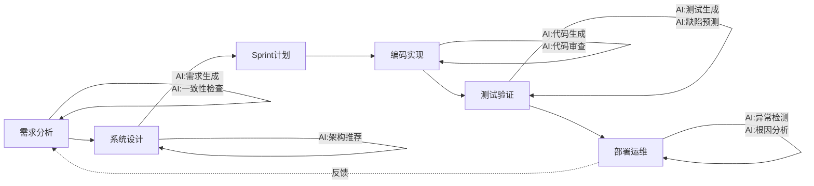
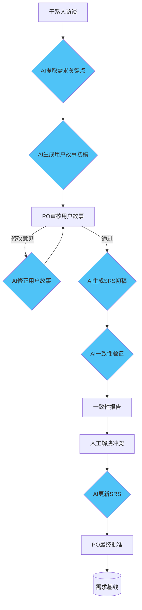
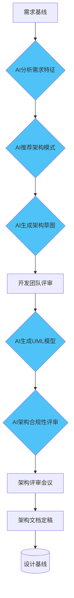
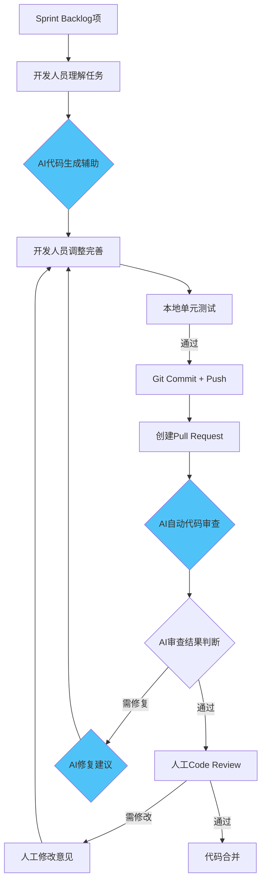
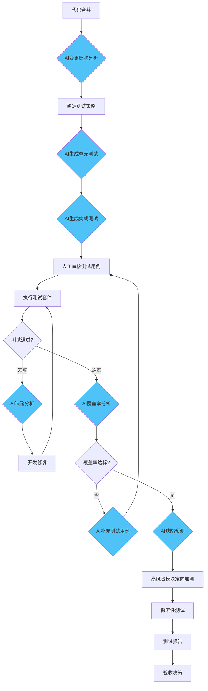

# 改进后的软件过程定义文档

## 第一部分：过程概述与目标

### 1.1 过程标识

| 属性 | 值 |
|------|-----|
| 过程名称 | AI增强型敏捷软件开发过程（AI-Augmented Agile Process, A3P） |
| 过程版本 | v2.0（AI增强版） |
| 基础过程 | Scrum敏捷开发过程 v1.0 |
| 适用项目类型 | 中型Web应用及企业级应用开发项目 |
| 发布日期 | 2026年6月 |

### 1.2 过程概述

AI增强型敏捷软件开发过程（A3P）是在传统Scrum敏捷过程基础上，深度融合AI技术的新一代软件过程体系。本过程保留Scrum的核心价值观和经验主义方法论，同时在需求分析、系统设计、编码实现、测试验证和运维监控全生命周期环节中系统性地融入AI技术节点，实现人机协同的智能化软件开发。

A3P过程遵循以下核心原则：
- **人机协同**：AI作为效率倍增器，人类作为质量守护者和最终决策者
- **渐进增强**：AI参与程度可配置，团队可根据成熟度逐步引入AI节点
- **质量优先**：所有AI输出须经过质量门禁，不可跳过人工审核环节
- **持续演进**：AI工具链和流程定期评估与更新，适应技术发展

### 1.3 过程目标

| 目标维度 | 具体目标 | 度量指标 |
|---------|---------|---------|
| 效率目标 | 整体开发效率提升50%以上 | AI辅助时间节省率 ≥ 50% |
| 质量目标 | 交付缺陷密度降低30%以上 | 每千行代码缺陷数 < 2.0 |
| 覆盖目标 | AI参与全生命周期60%以上活动 | AI参与环节覆盖率 ≥ 60% |
| 采纳目标 | AI产出物人工采纳率70%以上 | AI生成内容采纳率 ≥ 70% |
| 合规目标 | AI使用过程可审计、可追溯 | 100%AI参与环节有操作记录 |

### 1.4 适用场景与约束

**适用场景：**
- Web应用与后端服务开发
- 移动应用开发
- 企业级信息系统开发
- 具有明确需求边界的软件产品开发

**不适用场景：**
- 安全关键系统（如航空、医疗设备软件）需额外审批
- 嵌入式系统开发（AI工具链支持有限）
- 对知识产权保护有极高要求的项目

---

## 第二部分：角色与职责定义

### 2.1 角色体系总览

A3P过程在传统Scrum三大角色基础上，新增3个AI相关角色，形成9个角色的完整体系。

### 2.2 传统角色（保留）

| 角色 | 职责概述 | 主要活动 |
|------|---------|---------|
| 产品负责人（PO） | 产品愿景与需求决策 | 管理产品待办列表、确定需求优先级、验收交付物、审核AI生成的需求文档 |
| Scrum Master | 过程推进与障碍清除 | 组织Scrum仪式、推动AI工具引入流程、跟踪AI贡献度指标、消除团队障碍 |
| 开发团队（Dev Team） | 产品增量交付 | 编码实现、单元测试、代码审查（含AI辅助）、任务拆解与估算 |

### 2.3 AI相关角色（新增）

| 角色 | 职责概述 | 主要活动 | 所需技能 |
|------|---------|---------|---------|
| AI训练师 | AI工具效能管理 | Prompt工程、项目级配置管理、AI输出质量监控、团队培训 | Prompt Engineering、LLM基础、领域知识 |
| AI测试分析师 | 测试智能化管理 | AI生成测试用例审核、覆盖率分析、测试策略优化、误报分析 | 测试工程、AI测试工具、质量度量 |
| AI流程协调员 | 人机协同流程管理 | 工具链选型与更新、AI节点间上下文衔接、AI效能数据报告、应急回退决策 | AI技术视野、项目管理、风险管理 |

### 2.4 角色交互矩阵

| 交互关系 | PO | SM | Dev | AI训练师 | AI测试分析师 | AI流程协调员 |
|---------|----|----|-----|---------|------------|------------|
| 需求阶段 | ★ | ○ | ○ | ● | - | ○ |
| 设计阶段 | ● | ○ | ★ | ● | - | ○ |
| 编码阶段 | - | ○ | ★ | ● | - | ○ |
| 测试阶段 | ● | ○ | ● | ○ | ★ | ○ |
| 运维阶段 | - | ○ | ● | ○ | ○ | ★ |

> 图例：★ 主要负责 ● 重要参与 ○ 一般参与 - 不参与

---

## 第三部分：生命周期阶段与活动流程

### 3.1 阶段总览

A3P过程包含6个核心阶段，每个阶段明确AI参与节点：



### 3.2 阶段一：AI增强需求分析

**目标：** 高效产出高质量、一致性的需求规格说明



**活动详表：**

| 活动ID | 活动名称 | 执行者 | AI参与 | 输入 | 输出 |
|--------|---------|--------|--------|------|------|
| REQ-01 | 干系人访谈 | PO | 无 | 项目章程 | 访谈纪要 |
| REQ-02 | AI需求点提取 | AI训练师 | **AI执行** | 访谈纪要 | 需求点清单 |
| REQ-03 | AI用户故事生成 | AI训练师 | **AI执行** | 需求点清单+模板 | 用户故事初稿 |
| REQ-04 | PO用户故事审核 | PO | 无 | 用户故事初稿 | 审核意见 |
| REQ-05 | AI SRS生成 | AI训练师 | **AI执行** | 审核后用户故事 | SRS初稿 |
| REQ-06 | AI一致性验证 | AI训练师 | **AI执行** | SRS初稿 | 一致性报告 |
| REQ-07 | 需求冲突解决 | PO+团队 | 无 | 一致性报告 | 更新后SRS |
| REQ-08 | 需求基线建立 | PO | 无 | 最终SRS | 需求基线 |

### 3.3 阶段二：AI辅助系统设计

**目标：** 快速产出高质量的架构设计方案



**活动详表：**

| 活动ID | 活动名称 | 执行者 | AI参与 | 输入 | 输出 |
|--------|---------|--------|--------|------|------|
| DES-01 | AI需求特征分析 | AI训练师 | **AI执行** | 需求基线 | 特征分析报告 |
| DES-02 | AI架构模式推荐 | 开发团队 | **AI辅助** | 特征分析 | 架构候选方案 |
| DES-03 | AI架构草图生成 | 开发团队 | **AI辅助** | 选定方案 | 架构草图 |
| DES-04 | 人工架构评审 | 开发团队 | 无 | 架构草图 | 评审意见 |
| DES-05 | AI UML模型生成 | AI训练师 | **AI执行** | 架构设计 | UML图集 |
| DES-06 | AI架构合规检查 | AI训练师 | **AI执行** | UML+需求基线 | 合规报告 |
| DES-07 | 正式架构评审 | 全团队 | 无 | 全部设计产出 | 设计基线 |

### 3.4 阶段三：Sprint计划

**目标：** 结合AI分析的复杂度与风险评估，制定Sprint计划

| 活动ID | 活动名称 | 执行者 | AI参与 | 输入 | 输出 |
|--------|---------|--------|--------|------|------|
| PLN-01 | AI任务复杂度评估 | AI训练师 | **AI执行** | 产品待办项 | 复杂度评分 |
| PLN-02 | AI风险点标注 | AI流程协调员 | **AI执行** | 待办项+历史数据 | 风险标注报告 |
| PLN-03 | Sprint容量规划 | Scrum Master | 无 | 团队速率+复杂度 | Sprint容量 |
| PLN-04 | Sprint计划会议 | 全团队 | 无 | 上述全部输入 | Sprint Backlog |

### 3.5 阶段四：AI增强编码实现

**目标：** 高效产出高质量、安全的代码



**活动详表：**

| 活动ID | 活动名称 | 执行者 | AI参与 | 输入 | 输出 |
|--------|---------|--------|--------|------|------|
| COD-01 | 任务理解 | 开发人员 | 无 | Sprint Backlog项 | 任务理解 |
| COD-02 | AI代码生成 | 开发人员 | **AI辅助** | 任务+上下文 | 代码初稿 |
| COD-03 | 代码调整完善 | 开发人员 | **AI辅助** | AI生成代码 | 完成代码 |
| COD-04 | 本地单元测试 | 开发人员 | **AI辅助** | 完成代码 | 测试通过代码 |
| COD-05 | 创建PR | 开发人员 | 无 | 代码+描述 | Pull Request |
| COD-06 | AI代码审查 | AI流程协调员 | **AI自动执行** | PR Diff | AI审查意见 |
| COD-07 | 人工Code Review | 开发团队 | 无 | PR+AI意见 | 人工审查意见 |
| COD-08 | 代码合并 | 开发人员 | 无 | 审批后PR | 合并后代码库 |

**AI代码审查检查清单：**

1. [ ] 代码风格符合项目ESLint/Checkstyle规则
2. [ ] 无明显安全漏洞（OWASP Top 10）
3. [ ] 圈复杂度 ≤ 15
4. [ ] 函数行数 ≤ 50行
5. [ ] 测试覆盖率 ≥ 85%（新增代码）
6. [ ] 无明显代码坏味（重复代码、过长参数列表等）
7. [ ] 异常处理适当
8. [ ] 日志记录完整

### 3.6 阶段五：AI增强测试验证

**目标：** 高效实现高覆盖率的测试验证



**活动详表：**

| 活动ID | 活动名称 | 执行者 | AI参与 | 输入 | 输出 |
|--------|---------|--------|--------|------|------|
| TST-01 | AI变更影响分析 | AI测试分析师 | **AI执行** | 代码Diff | 影响分析报告 |
| TST-02 | 测试策略确定 | AI测试分析师 | 无 | 影响分析 | 测试策略 |
| TST-03 | AI测试用例生成 | AI测试分析师 | **AI执行** | 源码+策略 | 测试用例集 |
| TST-04 | 人工测试审核 | 测试工程师 | 无 | AI测试用例 | 审核后测试用例 |
| TST-05 | 执行测试 | CI/CD | 自动 | 测试套件 | 测试结果 |
| TST-06 | AI缺陷分析 | AI测试分析师 | **AI执行** | 失败日志 | 缺陷分析报告 |
| TST-07 | AI覆盖率分析 | AI测试分析师 | **AI执行** | 覆盖率数据 | 覆盖率报告 |
| TST-08 | AI补充测试 | AI测试分析师 | **AI执行** | 未覆盖代码 | 补充测试用例 |
| TST-09 | AI缺陷预测 | AI测试分析师 | **AI执行** | 代码变更+历史 | 风险热点图 |
| TST-10 | 定向加测 | 测试工程师 | 无 | 风险热点 | 加测用例 |
| TST-11 | 探索性测试 | 测试工程师 | 无 | 领域知识 | 探索性缺陷 |
| TST-12 | 测试报告 | CI/CD | 自动 | 全部测试结果 | 测试报告 |
| TST-13 | 验收决策 | PO+团队 | 无 | 测试报告 | 通过/不通过 |

### 3.7 阶段六：AI增强部署运维

**目标：** 保障系统稳定运行，缩短故障响应时间

| 活动ID | 活动名称 | 执行者 | AI参与 | 输入 | 输出 |
|--------|---------|--------|--------|------|------|
| OPS-01 | 部署执行 | CI/CD | 自动 | 发布包 | 部署结果 |
| OPS-02 | AI异常检测 | AI流程协调员 | **AI自动执行** | 监控指标流 | 异常告警 |
| OPS-03 | AI根因分析 | AI流程协调员 | **AI执行** | 告警上下文 | 根因候选 |
| OPS-04 | 人工根因确认 | 运维工程师 | 无 | AI根因分析 | 确认根因 |
| OPS-05 | 修复与回滚决策 | 运维工程师 | 无 | 根因 | 修复/回滚 |
| OPS-06 | AI告警收敛 | AI流程协调员 | **AI自动执行** | 告警风暴 | 收敛后告警 |
| OPS-07 | AI容量预测 | AI流程协调员 | **AI执行** | 历史负载数据 | 扩容建议 |

---

## 第四部分：交付物清单与质量标准

### 4.1 交付物总览

| 阶段 | 交付物名称 | 产出方式 | 负责人 | 质量标准 |
|------|-----------|---------|--------|---------|
| 需求分析 | 用户故事列表 | AI生成+人工审核 | PO | 验收条件完整，优先级清晰 |
| 需求分析 | 软件需求规格说明(SRS) | AI生成+人工审核 | PO | 符合IEEE 830，一致性验证通过 |
| 需求分析 | 需求一致性验证报告 | AI自动生成 | AI训练师 | 无P0级冲突未解决 |
| 系统设计 | 架构设计文档 | AI辅助+人工定稿 | 开发团队 | 覆盖所有关键质量属性 |
| 系统设计 | UML模型集 | AI生成+人工审核 | AI训练师 | 与需求可追溯 |
| 系统设计 | 架构合规性报告 | AI自动生成 | AI训练师 | 无严重偏离 |
| Sprint计划 | Sprint Backlog | 人工制定 | Scrum Master | 包含AI贡献度预估 |
| 编码实现 | 源代码 | AI辅助+人工编写 | 开发团队 | AI审查+人工审查通过 |
| 编码实现 | AI代码审查报告 | AI自动生成 | AI流程协调员 | AI审查通过或人工豁免 |
| 测试验证 | 测试用例集 | AI生成+人工审核 | AI测试分析师 | 分支覆盖率 ≥ 85% |
| 测试验证 | 测试执行报告 | CI自动生成 | CI/CD | 全部测试通过 |
| 测试验证 | AI缺陷预测报告 | AI自动生成 | AI测试分析师 | 风险热点标注准确率≥70% |
| 部署运维 | 部署记录 | CI自动生成 | CI/CD | 部署成功确认 |
| 部署运维 | AI运维监控日报 | AI自动生成 | AI流程协调员 | 异常告警无遗漏 |
| 全流程 | AI贡献度度量报告 | AI流程协调员 | AI流程协调员 | 每周更新 |

### 4.2 AI产物的特殊质量标准

任何AI生成的交付物，在进入下一环节前必须满足：

1. **来源标注**：明确标注"AI生成/人工审核"，标注AI工具名称与版本
2. **审核签章**：相应负责人已审核并签章
3. **版本控制**：AI输出的版本纳入Git管理，确保可追溯
4. **回退预案**：保留AI输出的上一版本，确保可回退

---

## 第五部分：过程度量指标

### 5.1 传统过程度量指标（保留）

| 指标类别 | 指标名称 | 计算方式 | 目标值 |
|---------|---------|---------|--------|
| 进度 | Sprint燃尽图完成率 | 实际完成/计划完成 | ≥ 90% |
| 进度 | 需求交付周期 | 需求提出到交付的天数 | ≤ 14天 |
| 质量 | 缺陷密度 | 缺陷数/千行代码 | < 2.0 |
| 质量 | 缺陷逃逸率 | 上线后发现缺陷/总缺陷 | < 5% |
| 效率 | 团队速率 | Sprint故事点完成数 | 稳定 |
| 效率 | 代码审查周期 | PR创建到合并的时间 | < 4小时 |

### 5.2 AI贡献度指标（新增）

| 指标类别 | 指标名称 | 计算方式 | 目标值 | 数据来源 |
|---------|---------|---------|--------|---------|
| 效率 | AI辅助时间节省率 | (传统耗时 - AI辅助耗时) / 传统耗时 | ≥ 50% | AI流程协调员手动统计 |
| 效率 | AI生成内容采纳率 | 被采纳的AI输出量 / AI总输出量 | ≥ 70% | 各环节人工审核记录 |
| 质量 | AI缺陷检出率 | AI发现的缺陷数 / 总缺陷数 | ≥ 40% | AI审查报告+缺陷跟踪 |
| 质量 | AI误报率 | AI误报数 / AI总报告数 | ≤ 5% | 人工审核确认 |
| 覆盖 | AI参与环节覆盖率 | 有AI参与的活动数 / 总活动数 × 100% | ≥ 60% | 过程执行记录 |
| 采纳 | AI生成代码接受率 | 接受的AI代码建议数 / AI总建议数 | ≥ 30% | GitHub Copilot统计 |
| 采纳 | AI测试用例接受率 | 接受的AI测试用例 / AI总生成数 | ≥ 80% | AI测试分析师记录 |

### 5.3 度量数据收集与报告

- **收集频率**：AI贡献度指标每周统计一次，传统指标每Sprint统计一次
- **报告责任**：AI流程协调员负责AI贡献度指标的收集与报告
- **可视化**：使用Grafana仪表盘实时展示关键指标趋势
- **评审会议**：每Sprint回顾会议评审AI贡献度数据，讨论改进措施

---

## 第六部分：过程资产与工具清单

### 6.1 AI工具清单

| 工具名称 | 版本/模型 | 应用阶段 | 许可类型 | 用途 |
|---------|----------|---------|---------|------|
| Claude (Anthropic) | Opus 4.7 | 需求、设计 | 企业版 | 文档生成、一致性验证 |
| GitHub Copilot | Latest | 编码 | Business | 代码生成、补全 |
| CodeRabbit | Latest | 编码 | SaaS | AI代码审查 |
| Diffblue Cover | 2025.x | 测试 | Community | Java单元测试生成 |
| WHartTest | Latest | 测试 | SaaS | UI测试用例生成 |
| JaCoCo | 0.8.12 | 测试 | 开源 | 覆盖率统计 |
| Datadog AI | Latest | 运维 | Enterprise | 异常检测、根因分析 |
| Structurizr DSL | Latest | 设计 | 开源 | 架构图生成 |

### 6.2 Prompt模板库（示例）

**SRS生成Prompt模板：**
```
你是一位资深需求分析师。请根据以下功能描述，生成符合[标准名称]标准的
软件需求规格说明（SRS）。

功能：[功能名称]
核心功能：
[功能点列表]

要求：
- 按[标准名称]格式组织
- 每个功能需求须包含：需求ID、描述、优先级、验收条件
- 须包含安全性、性能、可用性非功能需求
- 输出中文文档
```

**代码审查Prompt模板：**
```
请审查以下代码变更，重点关注：
1. 安全漏洞（OWASP Top 10）
2. 代码风格与规范
3. 潜在的性能问题
4. 异常处理是否完善
请按严重程度排序输出发现的问题，并给出修复建议。

[代码Diff]
```

---

## 第七部分：过程裁剪指南

### 7.1 裁剪原则

A3P过程可根据项目规模和团队成熟度进行裁剪：

| 项目规模 | 团队规模 | 建议裁剪 |
|---------|---------|---------|
| 小型 | 3-5人 | 合并AI训练师与AI测试分析师角色 |
| 中型 | 6-12人 | 使用完整A3P过程 |
| 大型 | 13+人 | 增设专职AI流程协调员，AI角色独立 |

### 7.2 AI参与程度配置

| 成熟度等级 | AI参与范围 | 适用条件 |
|-----------|-----------|---------|
| L1 初级 | 仅编码辅助（Copilot类） | AI工具使用经验 < 3个月 |
| L2 中级 | 编码+测试生成+代码审查 | AI使用经验 3-6个月 |
| L3 高级 | 全流程AI参与（完整A3P） | AI使用经验 > 6个月，有AI角色配置 |

---

**参考文献**

1. Schwaber, K. & Sutherland, J. The Scrum Guide[EB/OL]. 2024.
2. 中国信通院. 智能化软件工程技术和应用要求[S]. 2024.
3. IEEE. IEEE 830-1998: Recommended Practice for Software Requirements Specifications[S]. 1998.
4. GitHub. GitHub Copilot Trust Center[EB/OL]. 2025.
5. Google Cloud. 2025 Accelerate State of DevOps Report[R]. 2025.
6. CMMI Institute. CMMI V3.0 Model[EB/OL]. 2024.
7. ISO/IEC/IEEE. ISO/IEC/IEEE 12207:2017 Systems and Software Engineering[S]. 2017.
